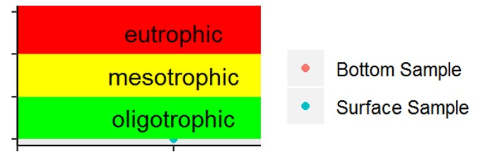

Just checking to make sure we have only one unique location per lake
```{r, echo=FALSE}
records<-unique(temp[c("LAKE_ID","LOCATION_ID")])
records
rm(records)
```


##Calculated 
###Trophic State
```{r, echo=FALSE,results='asis'}
score<-c(1,2,3)  
clarity<-c('<2','2-5','>5')
TP.surface<-c('>0.02','0.01-0.02','<0.01')
Chla<-c('>8','2-8','<2') 
trophic.subsets<-data.frame(score,clarity,TP.surface,Chla)
knitr::kable(trophic.subsets) 
rm(list=c('score','clarity','TP.surface','Chla','trophic.subsets'))

#trophic state score table
overall.score<-c('3','6 or <6','7 or 8','9')
trophic.state<-c('eutrophic','mesotrophic','mesooligotrophic','oligotrophic')
overall.trophic.state<-data.frame(overall.score,trophic.state)
knitr::kable(overall.trophic.state) 
rm(list=c('overall.trophic.state','overall.score','trophic.state'))
```				
###Public Water Supply Use
assuming this waterbody is a public water supply  

Components:  
UR - number of days PWS use was restricted  
AT - Additional Treatment (?? what does this mean? They are all blank?)  
MCL - any maximum contamination limit violations reported at the public water supply (??how did you get this info??)  
ChlA - What percent of the Chl A readings since 2011 exceeded the standard (class AA standard is >4, class A standard is >6)
HABs - How many days were HABs observed since 2011 (???This column (BF) in the excel table is blank so I'm wondering how you got this??)
BGA - Readings of FP-BGChl over 25 since 2011
sHABs - Count of shoreline habs that have FP-BGChl reading over 25 since 2011
Bind - Assuming the lake is neither class B or C, The number of Fe, Mn, As hypolimnion samples that exceeded thresholds. NOTE: inferred DO is calculated in aquatic life table ???Why do you only count Fe readings if there are more than one???  
  
Components:
```{r, echo=FALSE,results='asis'}
score<-c('-1',0,1.3,2.2,2.3,2.4,2.5,2.6,3.3,3.6,3.7,3.8,3.9,4.9)
UR<-c('not PWS',0,'','','','','','','','','','','0-30','>30')
AT<-c('not PWS','','','','','','','','','','','is PWS','','')
MCL<-c('not PWS','no','','','','','','','','','yes','','','')
ChlA<-c('','<10%','','','','','','10%-50%','','>50%','','','','')
HABs<-c('not PWS',0,'','','','','>0','','','','','','','')
BGA<-c('not PWS',0,'','','','>0','','','','','','','','')
sHABs<-c('not PWS',0,'','>0','','','','','','','','','','')
Bind <-c('','','av As>0.3 OR InferredDO>0','','av Mn>0.1 OR count(Fe>1)>1','','','','count(Fe>10)>1','','','','','')
PWS<-data.frame(score,UR,AT,MCL,ChlA,HABs,BGA,sHABs,Bind)
knitr::kable(PWS)
rm(list=c('score','UR','PWS','AT','MCL','ChlA','HABs','BGA','sHABs','Bind'))


```	
Total Score for Potable Water Supplies  
```{r, echo=FALSE,results='asis'}
score<-c(2,3,4,5,6)
avYear<-c('notPWS','0-1','max(PWS)>1','max(PWS)>2','max(PWS)>3')
y2018<-c('notPWS','max(PWS18)')
```	

## Secchi Depth
Secchi depth data were collected:

```{r, echo=FALSE}
secchi<-temp[temp$Characteristic.Name=="DEPTH, SECCHI DISK DEPTH",]
if((length(secchi$LAKE_ID))!=0){
secchi<-unique(secchi[c('SAMPLE_DATE','Result.Value')])
secchi<-secchi[!is.na(secchi$Result.Value),]
secchi$SAMPLE_DATE<-as.Date(secchi$SAMPLE_DATE,format="%Y-%m-%d")
secchi$year<-format(secchi$SAMPLE_DATE,"%Y")
secchi$year<-factor(secchi$year,unique(secchi$year))
secchi$day<-format(secchi$SAMPLE_DATE,"%j")
#print the unique years data were collected
unique(secchi$year)


library(ggplot2)
library(RColorBrewer)
  print(ggplot(data=secchi,aes(day,Result.Value)) +
  geom_rect(ymin=-2,ymax=0,xmin=-Inf,xmax=Inf,fill='red',alpha=0.02) +
  geom_rect(ymin=-5,ymax=-2,xmin=-Inf,xmax=Inf,fill='yellow',alpha=0.02) +
  geom_rect(ymin=-Inf,ymax=-5,xmin=-Inf,xmax=Inf,fill='green',alpha=0.02) +
  geom_bar(aes(fill=factor(year)),stat="identity",width=0.05,position="dodge") +
  scale_fill_brewer(palette="Greys") +
  geom_point(colour="black",shape=10,size=6) +
  scale_y_reverse(lim = c((max(secchi$Result.Value)+0.25),0)) +
  theme(legend.title=element_blank()) +
  theme(panel.grid.major = element_blank(), panel.grid.minor = element_blank(),
    panel.background = element_blank(), axis.line = element_line(colour = "black")) +
  labs(x="Day of Year", y="Secchi Depth (m)")) 
}
rm(secchi)

```

##Long Term Trend Data
Key to the symbology  
```{r fig.width=3, fig.height=1,echo=FALSE}
library(png)
library(grid)
img <- readPNG("symbology.png")
 grid.raster(img)
 #
```

```


```{r, echo=FALSE, results='asis'}
library(ggplot2)
library(gridExtra)
library(scales)
#pull long term trend parameters
trend<-temp[temp$Characteristic.Name=='PHOSPHORUS'|
             temp$Characteristic.Name=='ORTHOPHOSPHATE'|
             temp$Characteristic.Name=='CHLOROPHYLL A'|
             temp$Characteristic.Name=='CHLOROPHYLL A (PROBE)'|
             temp$Characteristic.Name=='CHLOROPHYLL A (PROBE) CONCENTRATION, DINOPHYTA (DIATOMS)'|
             temp$Characteristic.Name=='NITROGEN, NITRATE-NITRITE'|
             temp$Characteristic.Name=='INORGANIC NITROGEN (NITRATE AND NITRITE)'|
             temp$Characteristic.Name=='NITROGEN'|
             temp$Characteristic.Name=='NITROGEN, NITRATE (AS N)'|
             temp$Characteristic.Name=='NITROGEN, KJELDAHL, TOTAL'|
             temp$Characteristic.Name=='CALCIUM'|
             temp$Characteristic.Name=='APPARENT COLOR'|
             temp$Characteristic.Name=='COLOR, UNKNOWN'|
             temp$Characteristic.Name=='TRUE COLOR'|
             temp$Characteristic.Name=='PH'|
             temp$Characteristic.Name=='PH FOR COLOR ANALYSIS'|
             temp$Characteristic.Name=='CONDUCTIVITY'|
             temp$Characteristic.Name=='SPECIFIC CONDUCTANCE'|
             temp$Characteristic.Name=='TEMPERATURE, WATER',]
trend<-trend[trend$INFO_TYPE=="OW"|trend$INFO_TYPE=="BS",]
trend<-unique(trend[c('Characteristic.Name','Result.Value','Result.Unit','INFO_TYPE','SAMPLE_NAME','DATA_PROVIDER','SAMPLE_DATE','START_DEPTH','END_DEPTH')])
trend<-trend[!is.na(trend$Result.Value),]
trend<-trend[!is.na(trend$Characteristic.Name),]

if((length(trend$Result.Value))!=0){
params<-unique(trend$Characteristic.Name)
nparams<-length(params)
p<-list()
j<-1

for(i in 1:nparams){
  trend1<-trend[trend$Characteristic.Name==params[i],]
  trend1<-trend1[!is.na(trend1$Characteristic.Name),]
  trend1<-trend1[!is.na(trend1$Result.Value),]
  thresh<-thresholds[thresholds$Characteristic.Name==params[i],]
  if((length(trend1$Result.Value))!=0){
    trend1$year<-format(trend1$SAMPLE_DATE,"%Y")
    trend1$year<-factor(trend1$year,unique(trend1$year))
       if(length(unique(trend1$year))>1){
      p[[j]]<-(ggplot(trend1,aes(SAMPLE_DATE,Result.Value)) +
        geom_rect(ymin=0,ymax=thresh$ystart[1],xmin=-Inf,xmax=Inf,fill='red',alpha=0.02) +
        geom_rect(ymin=thresh$ystart[1],ymax=thresh$yend[1],xmin=-Inf,xmax=Inf,fill='yellow',alpha=0.02) +
        geom_rect(ymin=thresh$yend[1],ymax=Inf,xmin=-Inf,xmax=Inf,fill='green',alpha=0.02) +
        geom_point(aes(color=factor(INFO_TYPE))) +
        theme(axis.title.x = element_blank()) +
        theme(panel.grid.major = element_blank(), panel.grid.minor = element_blank(),
              panel.background = element_blank(), axis.line = element_line(colour = "black"),
              legend.position="none") +
        scale_x_date(labels = date_format("%Y")) +
        labs(title=params[i], y=trend1$Result.Unit[1],colour = ""))
    }
    if(length(unique(trend1$year))<=1){
      p[[j]]<-(ggplot(trend1,aes(SAMPLE_DATE,Result.Value)) +
        geom_rect(ymin=0,ymax=thresh$ystart[1],xmin=-Inf,xmax=Inf,fill='red',alpha=0.02) +
        geom_rect(ymin=thresh$ystart[1],ymax=thresh$yend[1],xmin=-Inf,xmax=Inf,fill='yellow',alpha=0.02) +
        geom_rect(ymin=thresh$yend[1],ymax=Inf,xmin=-Inf,xmax=Inf,fill='green',alpha=0.02) +
        geom_point(aes(color=factor(INFO_TYPE))) +
        theme(panel.grid.major = element_blank(), panel.grid.minor = element_blank(),
              panel.background = element_blank(), axis.line = element_line(colour = "black"),
              legend.position="none") +
        theme(axis.title.x = element_blank()) +
        scale_x_date(labels = date_format("%m-%Y")) +
        labs(title=params[i], y=trend1$Result.Unit[1],colour = ""))
    }
  j<-j+1
  }
  if(i==4|i==8|i==12|i==16|i==nparams){
    do.call(grid.arrange,c(p,ncol=2))
    p<-list()
    j<-1
  }
  rm(list=c('trend1','thresh'))
  }
rm(list=c('i','params','nparams','p','j'))
}
rm(list=c('trend'))
```

## Depth Profiles
```{r, echo=FALSE, results='asis'}
profile<-temp[temp$INFO_TYPE=="DP",]
profile<-unique(profile[c('LAKE_ID','LOCATION_ID','Characteristic.Name','Depth','Result.Value','SAMPLE_DATE')])
profile$Characteristic.Name[profile$Characteristic.Name==""] <- NA
profile<-profile[!is.na(profile$Characteristic.Name),]
if((length(profile$Result.Value))!=0){
library(ggplot2)
  library(gridExtra)
params<-unique(profile$Characteristic.Name)
nparams<-length(params)
p<-list()
for(i in 1:nparams){
  profile1<-profile[profile$Characteristic.Name==params[i],]
  profile1<-profile1[!is.na(profile1$Characteristic.Name),]
  profile1<-profile1[order(profile1$SAMPLE_DATE,profile1$Depth),]
  profile1$SAMPLE_DATE<-format(profile1$SAMPLE_DATE,"%Y.%m.%d")
  profile1$SAMPLE_DATE<-factor(profile1$SAMPLE_DATE,unique(profile1$SAMPLE_DATE))
  p[[i]]<-(ggplot(profile1[order(profile1$Depth,profile1$SAMPLE_DATE),],aes(Result.Value,Depth)) +
    geom_point() +
    geom_path(aes(color=factor(SAMPLE_DATE))) +
    scale_y_reverse(lim = c((max(profile$Depth)+0.25),0)) +
    theme(axis.title.x = element_blank()) +
    labs(title=params[i], y="Depth (m)",colour = "")) 
  rm(list=c('profile1'))
}

do.call(grid.arrange,c(p,ncol=3))
}
rm(list=c('profile','i','params','nparams','p'))
```
